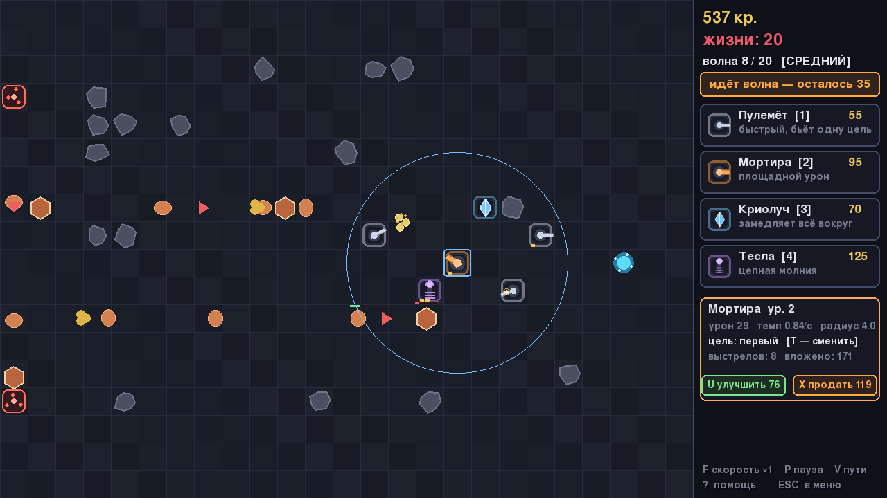

ПОСЛЕДНИЙ РЕАКТОР
=================

Tower defense про оборону реактора в разрушеном комплексе. Двадцать волн
лезут из двух порталов к ядру, вы строите башни. Главная особенность жанровая:
дорожки для врагов здесь не нарисованы заранее — башни и есть стены, и враги
каждый раз заново ищут путь между ними. То есть вы не расставляете пушки вдоль
трассы, а строите саму трассу: длинный кривой коридор из башен, по которому
волна ползёт под огнём. Полностью замуровать проход игра не даст.

Это третья моя игра на питоне, и в ней меня интересовал вопрос «как водить
сотню существ одновременно и не умереть по производительности». Ответ
оказался красивым — смотрите ниже про потоковое поле.

Ассетов в проекте по прежнему ноль: вся графика рисуется кодом при запуске,
все звуки синтезируются математикой в буфер. Ни одной картинки, ни одного
wav-файла.

Как запустить
-------------

Нужен Python 3.8+ и pygame. На Windows ставить руками ничего не надо.

**Windows, в один клик**

1. Скачайте папку с проектом и распакуйте куда угодно. Именно распакуйте,
   из архива запускать бесполезно.
2. Дважды кликните `PLAY.bat`.
3. Откроется консоль. Первый запуск идёт около полуминуты: скрипт найдёт
   Python (или поставит его через winget), докачает pygame — примерно 10 МБ.
   Что он делает, он пишет на экран.
4. Когда появится «Запускаю», откроется окно игры. Консоль не закрывайте.
5. В меню выберите сложность клавишами 1–3 и нажмите `n`.

Можно и без bat-файла: правый клик по `run.ps1` → «Выполнить с помощью
PowerShell». А вот копировать текст скрипта в открытую консоль не надо —
при копипасте он не знает, где лежит, и работает не в той папке. Проверено
на себе, теперь скрипт от этого защищается сам.

**Linux и macOS**

    python3 -m pip install -r requirements.txt
    python3 main.py

**Если что-то пошло не так** — раздел одинаковый для всех моих игр:
консоль моргнула и закрылась → запускайте `run.ps1` правой кнопкой, текст
ошибки останется; «выполнение сценариев отключено» → запускайте через
`PLAY.bat`; «python не является внутренней или внешней командой» → при
установке Python не поставили галочку «Add Python to PATH».

Управление
----------

    1 2 3 4      выбрать башню в магазине, клик по полю — поставить
    ПКМ / Esc    отменить выбор
    клик по башне выбрать её: U — улучшить, X — продать, T — режим цели
    SPACE        выпустить следующую волну
    F            скорость ×1 ×2 ×3
    P            пауза
    V            показать стрелками, как пойдут враги
    ?            помощь
    Esc          в меню — партия сохраняется сама

Горячие клавиши привязаны к физическим клавишам, а не к символам, так что
работают в любой раскладке — «Т» на русской это та же T.

Башни четыре: пулемёт (быстрый, по одной цели), мортира (медленная, но бьёт
по площади — идеальна против плотной толпы), криолуч (замедляет всех вокруг
себя, сам почти не ранит) и тесла (молния перепрыгивает по цепочке на
соседей и игнорирует броню). У каждой три уровня и четыре режима выбора цели:
первый, последний, самый крепкий, ближний. Продажа возвращает 70% всего
вложеного.

Враги тоже разные: жуки просто идут, бегуны несутся втрое быстрее, у
броненосцев броня срезает часть урона от каждого попадания, рой при смерти
лопается на трёх мелких клещей, а каждая пятая волна приводит босса. На
двадцатой их сразу два.

Как оно устроено
----------------

**Потоковое поле.** Классический вопрос TD: как сто врагов одновременно ищут
путь? Если каждому давать свой A*, при постройке башни придётся пересчитать
сто маршрутов. Здесь наоборот: один поиск в ширину от реактора расходится по
всей карте и оставляет в каждой клетке стрелку «куда шагать, чтобы стать
ближе к ядру». Враг любой численности просто читает стрелку под ногами.
Постройка башни — один пересчёт поля на ~450 клеток, у меня он занимает
треть миллисекунды.

**Запрет замуровывания.** Перед постройкой клетка временно блокируется и
поле пересчитывается: если хоть один портал — или хоть один живой враг —
теряет путь к ядру, постройка отклоняется. Поэтому лабиринт можно вить как
угодно, но задушить проход целиком нельзя.

**Упреждение.** Пуля летит с известной скоростью, скорость врага тоже
известна, значит точка встречи — корень квадратного уравнения. Пулемёт и
мортира стреляют не «в врага», а «туда, где враг окажется». Без этого
бегуны просто убегали бы от пуль — я сначала так и сделал, и они убегали.

**Волны без случайности.** Состав волны — чистая функция её номера: бюджет
очков растёт квадратично и тратится на открытые к этому моменту типы врагов.
Поэтому сохранение не хранит очередь, а превью на панели всегда точное.

**Сохранение.** JSON между волнами: сид карты, деньги, жизни, номер волны и
список башен. Камни на карте восстанавливаются из сида, состав волн — из
номера. Файл на пару килобайт, никакого pickle.

Файлы:

    main.py       окно, состояния, ввод (сканкоды!)
    settings.py   весь баланс в одном месте
    engine.py     симуляция боя: деньги, волны, снаряды
    grid.py       поле, камни, потоковое поле, запрет замуровывания
    enemies.py    типы врагов и движение по стрелкам
    towers.py     башни, выбор цели, упреждение
    waves.py      состав волн из бюджета
    graphics.py   вся графика кодом
    renderer.py   поле, панель, экраны
    sounds.py     синтезатор эффектов
    savegame.py   JSON-сохранение
    tests/        headless-тест

Баланс крутится в `settings.py` и в таблицах `TYPES` — хотите пулемёт за 10
монет, никто не осудит.

Тест прогоняет всё без окна: потоковое поле на тридцати картах и его
монотонность, отказ замуровать проход, перехват движущейся цели с проверкой
математики, сплеш, цепную молнию, замедление, броню, деление роя, все четыре
режима цели, экономику до монеты, состав всех двадцати волн, оборону из трёх
пулемётов без единой утечки, сохранение туда-обратно, победу, поражение и
все экраны:

    SDL_VIDEODRIVER=dummy SDL_AUDIODRIVER=dummy python tests/smoke_test.py

Он же рисует скриншот выше — на фиксированном сиде, с настоящим боем.

Чего пока нет
-------------

Карта одна на партию (сид случайный, так что расстановка камней всякий раз
другая). Нет летающих врагов, которые плевали бы на лабиринт — по честному,
именно их не хватает сильнее всего. Нет и бесконечного режима после
двадцатой волны, хотя движок бы выдержал.

Пройти на кошмаре у меня получилось не с первого раза — криолуч в изгибе
коридора решает больше, чем кажется.

Лицензия
--------

MIT. Берите, ломайте, переделывайте. Папка проекта называется `last-reactor`.

RustamChu, 2026
